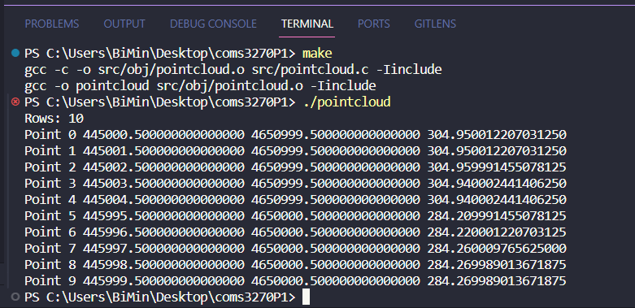

# coms3270P1

# if you want to run by gcc change the path 
# from char* fname = "./data/input.txt"; 
# to char* fname = "../data/input.txt";

# on the top directory of project you just types make, after that types pointcloud to run the program

# references
https://www.geeksforgeeks.org/dynamically-growing-array-in-c/
https://www.hackerearth.com/practice/notes/void-pointer-in-c/
https://docs.silabs.com/mcu/5.8/efr32bg13/bmp-c
https://cppcoder.blogspot.com/2007/11/bmp-file-format.html
https://stackoverflow.com/questions/14279242/read-bitmap-file-into-structure
